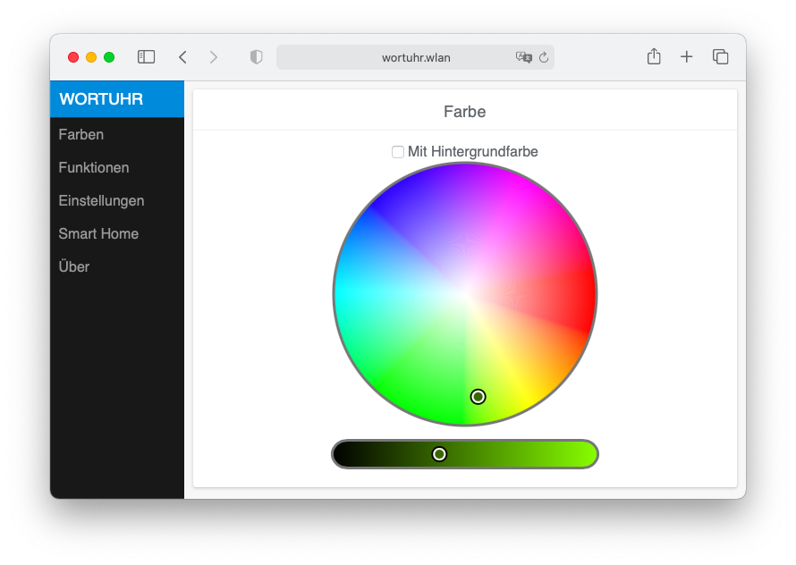
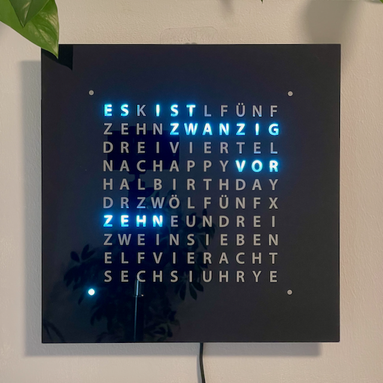
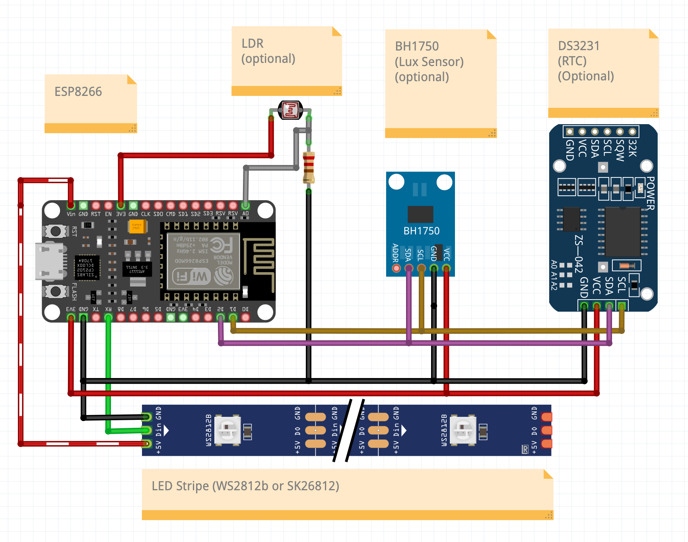

[](https://github.com/ESPWortuhr/Multilayout-ESP-Wordclock/actions/workflows/platformio.yml)
[](https://github.com/ESPWortuhr/Multilayout-ESP-Wordclock/actions/workflows/nightly.yml)
[](https://github.com/ESPWortuhr/Multilayout-ESP-Wordclock/actions/workflows/clang-format.yml)

🇬🇧 English | [🇩🇪 Deutsch](README.md)

# ESP Wordclock



This is a project for a multilingual word clock based on an ESP8266 microcontroller and a programmable LED strip (WS2812 or SK6812). A word clock is a beautiful DIY project for beginners that combines technology and design to create a functional and aesthetically pleasing clock.
Whether you are a beginner or an experienced maker, this project is a great way to put your skills to work and build something truly special.
The software offers many features:
- Multilingual:
  - 🇬🇧 English
  - 🇩🇪 German (Deutsch)
  - 🇪🇸 Spanish (Español)
  - 🇮🇹 Italian (Italiano)
  - 🇳🇱 Dutch (Nederlands)
  - 🇭🇺 Hungarian (Magyar)
  - 🇷🇴 Romanian (Română)
  - 🇨🇭 Swiss German (Schwiizerdütsch)
  - 🇷🇺 Russian (Русский)
  - 🇸🇪 Swedish (Svenska)
  - 🇫🇷 French (Français)
  - 🇧🇩 Bengali (বাংলা)
- Support for multiple layouts and LED spacings
- Adjustable display colour (RGB or RGBW)
- Digital clock display
- Rainbow colour cycle
- Ambient light (implemented as a seconds hand)
- Automatic brightness control (optional, via LDR)
- A choice of dialect-specific displays
- Home Assistant integration with autodiscovery


## Table of contents

- [Clock display modes](#clock-display-modes)
- [Required hardware and software](#required-hardware-and-software)
- [Installing and flashing the firmware](#installing-and-flashing-the-firmware)
  - [Windows](#windows-graphical-interface)
  - [MacOS](#macos)
  - [Linux](#linux)
  - [Flashing a prebuilt firmware (no development environment)](#flashing-a-prebuilt-firmware-no-development-environment)
  - [Nightly builds (current development state)](#nightly-builds-current-development-state)
  - [After the installation: first start](#after-the-installation-first-start)
- [Wiring the hardware](#wiring-the-hardware)
- [Mechanical structure of a word clock](#mechanical-structure-of-a-word-clock)
- [Configuration overview](#configuration-overview)
- [MQTT API documentation](#mqtt-api-documentation)
- [Contributing](#contributing)
- [BSD-3 license](#bsd-3-license)

## Clock display modes

<p align="center">
 
 
 
 

</p>

## Required hardware and software
* Hardware
    * NodeMCU or a comparable board with an ESP8266, ESP8285, ESP32 or ESP32C3
    * WS2812B RGB LED strip or SK6812 RGBW strip
    * 5V 2A power supply
    * Optional: LDR, 10 kOhm resistor

* Software
    * PlatformIO [Core](https://docs.platformio.org/en/latest/core/installation.html) or [IDE](https://platformio.org/install/ide?install=vscode)
    * [Node.js](https://www.nodejs.org/)
    * [Git](https://git-scm.com)

---

## Installing and flashing the firmware

Many development boards (such as the NodeMCU or Wemos D1 Mini) require a USB-to-serial driver (usually **CH340** or **CP210x**). Install it if your computer does not recognise the board after plugging it in.

There are two routes to a working clock:

* **Build it yourself** (the Windows/MacOS/Linux sections below). This is the only way to adapt the clock to your own layout, language and hardware through `include/Config.h`. For most builds this is the right choice.
* **[Flash a prebuilt firmware](#flashing-a-prebuilt-firmware-no-development-environment)** without a development environment. Faster, but the default settings are compiled in.

### Windows (graphical interface)

The easiest route for Windows users is the graphical interface of Visual Studio Code (VS Code).

1. **Install the prerequisites:**
   * Install **PlatformIO IDE** (this installs Visual Studio Code automatically), **Node.js** and **Git** manually using the links above.
   * After installing VS Code you will find a new **PlatformIO icon** (a small alien head) in the left sidebar.

2. **Download the project (clone):**
   * Click the PlatformIO icon.
   * In the menu go to `Quick Access` > `Miscellaneous` and choose `Clone Git Project`.
   * Enter `https://github.com/ESPWortuhr/Multilayout-ESP-Wordclock` as the URL and pick a location on your disk.
   * Then go to `Projects`, add the freshly downloaded project via `Add Existing` and click `Open`.

3. **Compile and upload the software:**
   * Connect your ESP to the computer with a USB cable. *(Careful: use a data cable, not a charge-only cable!)*
   * The PlatformIO sidebar contains a `Project Tasks` section.
   * Expand your board environment and choose `General` > `Upload`.
   * **Be patient:** the first run takes several minutes because PlatformIO downloads all required libraries in the background and compiles the software from scratch.
   * When it finishes, a green "SUCCESS" message appears.

### MacOS

On macOS you can use Visual Studio Code as described for Windows. If you prefer the terminal, the route via the [Homebrew](https://docs.brew.sh/Installation) package manager is considerably faster:

1. Open the terminal.
2. Run the following commands one after another to install the tools, download the project and flash the ESP:

```sh
# Install PlatformIO and Node.js
brew install platformio
brew install node

# Download the project directory
git clone https://github.com/ESPWortuhr/Multilayout-ESP-Wordclock.git
cd Multilayout-ESP-Wordclock

# Connect the ESP and flash it
pio run -t upload
```

### Linux

On Linux (e.g. Ubuntu, Debian, Raspberry Pi OS) the firmware can be compiled and flashed from the terminal as well.

Important note for Linux users: make sure your user account is allowed to access serial ports (usually by adding the user to the `dialout` group via `sudo usermod -a -G dialout $USER`). A reboot may be required afterwards.

```sh
# Run the PlatformIO installer script
python3 -c "$(curl -fsSL https://raw.githubusercontent.com/platformio/platformio/master/scripts/get-platformio.py)"

# Install the Node.js package manager
sudo apt update
sudo apt install npm git

# Download the project and change into the directory
git clone https://github.com/ESPWortuhr/Multilayout-ESP-Wordclock.git
cd Multilayout-ESP-Wordclock

# Connect the ESP and flash it
pio run -t upload
```

### Flashing a prebuilt firmware (no development environment)

If you do not want to compile the clock yourself, use the prebuilt binaries from the [releases page](https://github.com/ESPWortuhr/Multilayout-ESP-Wordclock/releases). There is one file per chip, e.g. `ESP32_V4.4.0.bin`.

> **Important:** these files carry the default configuration from `include/Config.h` (German layout `Ger10x11Alternative`, GRB LEDs, no I2C). If you use a different layout, a different language or an RTC, you have to compile the firmware yourself.

**Route 1 — update through the web interface (recommended, no cable needed)**

If the clock already runs a firmware, the built-in OTA updater handles the update:

1. Open `http://<clock-ip>:81/update` in your browser (note **port 81**).
2. Select the downloaded `.bin` file and start the upload.
3. The clock reboots automatically once the image is written. WiFi and colour settings are preserved.

If `WEB_PROTECTED` is set to `true` in the configuration, the updater asks for a user name and password first (`WEB_USER` / `WEB_PASSWORD`).

**Route 2 — serial flashing with esptool**

For a brand-new board or a clock that no longer boots. Requires Python with `esptool` (`pip install esptool`):

```sh
# ESP8266 (NodeMCU, Wemos D1 Mini)
esptool.py --chip esp8266 --port /dev/ttyUSB0 write_flash 0x0 ESP8266_V4.4.0.bin

# ESP32 and ESP32-C3: the file contains the application only
esptool.py --chip esp32 --port /dev/ttyUSB0 write_flash 0x10000 ESP32_V4.4.0.bin
```

On Windows the port is called `COM3` or similar, on macOS `/dev/cu.usbserial-*`.

**Route 3 — browser flasher (no installation)**

If you want to install neither PlatformIO nor Python, you can flash the ESP straight from your browser. These tools talk to the chip through the Web Serial API:

| Tool | Note |
| :--- | :--- |
| [esptool-js](https://espressif.github.io/esptool-js/) | The official browser port of esptool by Espressif. File and offset are entered manually — the offsets above apply. |
| [ESP Web Flasher (esp.huhn.me)](https://esp.huhn.me/) | Simpler interface, also with a free-form offset field. |

How it works: connect the ESP over USB, click **Connect** in the tool, confirm the serial port of your board, load the `.bin` file with the matching offset and start writing.

> **Requirement:** Web Serial is only supported by Chromium-based browsers (Chrome, Edge, Opera) and only over HTTPS. Firefox and Safari cannot do this. The browser also needs exclusive access to the port — close any serial monitor beforehand.

> **Note for ESP32/ESP32-C3:** offset `0x10000` writes the application only. This assumes the bootloader and the partition table are already present on the chip, which is the case for any board that has run an ESP32 Arduino firmware before. A completely empty chip additionally needs `bootloader.bin` (offset `0x1000`, on the ESP32-C3 `0x0`) and `partitions.bin` (offset `0x8000`). Those two files are not part of the releases — use `pio run -t upload` in that case, which writes everything required.

### Nightly builds (current development state)

For every state of `main`, a GitHub Actions workflow builds the firmware for all three chips automatically — useful for testing a bug report or a freshly merged feature without compiling yourself.

1. Open the [Actions → Nightly Firmware](https://github.com/ESPWortuhr/Multilayout-ESP-Wordclock/actions/workflows/nightly.yml) tab.
2. Select the topmost successful run.
3. Under **Artifacts** you will find `firmware-ESP8266`, `firmware-ESP32` and `firmware-ESP32C3` for download.

The archive contains the `.bin` named `<chip>_V<version>_<commit>.bin`, a `.sha256` checksum and the `.elf` file needed to decode a crash backtrace. Flashing works exactly as described above.

Please note:

* Downloading requires a GitHub account (a GitHub restriction on artifacts).
* Artifacts are deleted automatically after **14 days**.
* These are **untested development builds**, not releases. If you want a stable clock, use the releases page.

### After the installation: first start

Once the upload to the ESP has succeeded (`SUCCESS` message in the terminal), the clock reboots.

1. The word clock now opens its own WiFi network (access point).
2. Search for a new WiFi network with your phone or laptop (usually "Wortuhr" or similar) and connect to it.
3. A login window (captive portal) should open automatically. If it does not, open your browser and go to `http://192.168.4.1`.
4. Enter your home WiFi credentials there. The clock reboots, connects to your home network and is reachable at its own IP address from then on.

---

## Wiring the hardware


## Mechanical structure of a word clock

This guide describes the typical layer structure and the electronic configuration of a DIY word clock. The specifications assume the classic 11x10 letter grid plus 4 separate minute LEDs.

### 1. The mechanical layers (front to back)

* **Front panel:** the visible layer with the punched or laser-cut letters (often stainless steel, coated acrylic or wood veneer).
* **Diffuser layer:** a milky film or a sheet of tracing paper directly behind the front panel. It scatters the LED light softly and evenly.
* **Light grid (baffle):** a grid (usually wood, MDF or 3D printed) that separates each LED from its neighbours. It strictly prevents light from bleeding sideways onto adjacent, inactive letters.
* **Backing plate (rear panel):** a rigid plate onto which the LED strips are glued horizontally, aligned with the light grid.

### 2. LED matrix specifications (WS2812B / Neopixel)

To fill the letter grid exactly, the LED spacing (LEDs per metre) has to match the size of the clock. The common enclosure sizes lead to the following requirements:

| Enclosure size (front) | Matrix size | Recommended LED strip | Wiring particularity |
| :--- | :--- | :--- | :--- |
| **30 x 30 cm** | 25 x 25 cm | 60 LEDs/m | Standard size. Perfect LED spacing for every grid cell. |
| **40 x 40 cm** | 35 x 35 cm | 74 LEDs/m | Every second LED of a row stays unused (skipped in software or hardware). |
| **50 x 50 cm** | 50 x 50 cm | 30 LEDs/m | The natural LED spacing matches the larger grid directly. |

> **Note on gluing:** the LED strips are typically glued to the backing plate in a serpentine (zig-zag) pattern. The data output (DOUT) of one row is connected to the data input (DIN) of the row directly below it, on the same side.

### 3. Electronics and components

The matching schematic is shown above under [Wiring the hardware](#wiring-the-hardware).

* **Microcontroller:** an ESP8266 (e.g. Wemos D1 Mini) or ESP32. It drives the LEDs and usually synchronises the time automatically over your home WiFi (NTP server).
* **Power supply:** a strong 5V power supply. When many letters light up in white, the matrix can draw several amperes. A 5V / 3A to 5A supply is recommended.
* **Real-time clock (RTC):** a module such as the DS3231 (optional but recommended). Its coin cell keeps the time accurate during a power failure or without WiFi.
* **Level shifter:** since the ESP works at 3.3V while the LEDs expect 5V data levels, a level shifter (e.g. 74AHCT125) ensures a clean signal (a direct connection through a 470 Ohm resistor is often sufficient as well).

### 4. Basic wiring diagram

* **Power supply 5V (+):** connect to the 5V pin of the microcontroller AND to the 5V input of the LED strip.
* **Power supply GND (-):** connect to the GND pin of the microcontroller AND to the GND input of the LED strip.
* **Microcontroller data pin:** connect to the DIN (data in) of the very first LED strip in the matrix.

---

## Configuration overview

The settings below come from the file `include/Config.h`.
Many of them can also be changed conveniently through the web interface of the clock later on.

### Hardware & pins (ESP32)
Defines which pins the hardware is connected to (note: the ESP8266 is currently not supported for these specific pins).
* **`LED_PIN`**: pin for the LED data channel. *(Default: 3, which is the RX pin on the ESP8266)*
* **`SDA_PIN_ESP32` / `SCL_PIN_ESP32`**: pins for I2C communication (e.g. for the RTC or light sensor). *(Default: both `255`, i.e. the I2C bus is disabled)*
  * These pins do not have to be set in the source code: the web interface under **Settings → Hardware pins** lets you enter and save SDA and SCL directly. There, too, `255` means "disabled".
  * The **Scan I2C addresses** button starts a scan of the bus (addresses 1-126). The result field lists every address found — handy to verify that an RTC (DS3231, usually `0x68`) or a BH1750 light sensor (`0x23` or `0x5C`) is wired correctly. If the scan reports "No I2C addresses found", the wiring or the pin assignment is usually wrong.
* **`RTC_Type`**: the real-time clock module used, so the clock keeps running without WiFi. *(Default: `RTC_DS3231`)*

### Language & front layout
Defines the language and the grid the word clock is built with. A large number of languages is available (German, English, Dutch, Spanish, etc.).
* **`DEFAULT_LAYOUT`**: *(Active default: `Ger10x11Alternative`)*
  * 10 rows, 11 LEDs per row + 4 minute LEDs.
  * This is the alternative German layout by GitHub user @dbambus with additional words.

### LEDs & display
Specifies the type of LEDs used and the default colour values at start-up.
* **`DEFAULT_LEDTYPE`**: the colour order of the LED strip.
* **`WHITE_LEDTYPE`**: colour temperature when RGBW LEDs are used. *(Default: `NeutralWhite`)*
* **`DEFAULT_HUE`**: default hue at start-up (0-360). *(Default: `120` — green)*
* **`DEFAULT_BRIGHTNESS`**: initial brightness in percent.
* **`DEFAULT_BUILDTYPE`**: matrix construction type. *(Default: `Normal` — every LED on the strip is used)*
* **`MINUTE_...`**: type of minute display. *(Default: `MINUTE_LED4x` — 4 separate LEDs for the minutes)*

### Brightness control
Settings for automatic brightness adjustment through external sensors.
* **`AUTOBRIGHT_USE_BH1750`**: use of a digital light sensor.
* **`AUTOBRIGHT_USE_LDR`**: use of an analogue photoresistor.
  * *Note: since both are set to `false`, automatic brightness control is currently disabled.*
* **LDR resistance values**: if an LDR is used, the calibration values for the voltage divider are stored here (`RESBRIGHT 15`, `RESDARK 1000`, `RESDIVIDER 10`).

### WiFi & captive portal
Network configuration.
* **`MANUAL_WIFI_SETTINGS`**: whether the WiFi credentials are hard-coded.
* **`WIFI_SSID`**: the name of your WiFi network.
* **`WIFI_PASSWORD`**: your WiFi password.
* **`CP_PROTECTED` / `CP_SSID` / `CP_PASSWORD`**: settings for the captive portal (the clock's own WiFi network used for the initial setup). *(Default: unencrypted, SSID: `"Connect_to_Wordclock"`)*

### System & boot behaviour
Settings for the start-up process and for debugging.

### Matrix & wiring settings
Defines how the LEDs are physically glued and wired inside the clock (e.g. where the strip starts and whether it runs in a zig-zag pattern).
* **`REVERSE_MINUTE_DIR`**: reverses the direction of the minute LEDs.
* **`MIRROR_FRONT_VERTICAL` / `HORIZONTAL`**: mirrors the display vertically or horizontally.
* **`EXTRA_LED_PER_ROW`**: if additional (blind) LEDs are installed per row.
* **`FLIP_HORIZONTAL_VERTICAL`**: swaps the X and Y axes (useful for a wrong orientation).
* **`MEANDER_ROWS`**: whether the LED strip was glued in a serpentine (zig-zag) pattern.

---

## MQTT API documentation

The clock uses the **JSON light schema** of Home Assistant. This means commands and status messages are exchanged in JSON format over MQTT.

### 1. MQTT topics
The clock uses a base topic which is defined in the settings of the clock (web interface). Throughout this documentation it is referred to as `<TOPIC>` (e.g. `ESPWordclock`).

| Function | Topic | Description |
| :--- | :--- | :--- |
| **Send commands** | `<TOPIC>/cmd` | Send JSON commands to this topic to control the clock. |
| **Receive status** | `<TOPIC>/status` | The clock publishes its current state to this topic after every change. |
| **Availability** | `<TOPIC>/availability` | Indicates whether the clock is online (`online` or `offline` via last will). |

---

### 2. Sending commands (command payload)
Commands are sent as a JSON string to the topic `<TOPIC>/cmd`. You can combine several parameters in a single message.

#### Supported JSON parameters:

* **`state`** (string)
  Turns the LEDs of the clock on or off.
  * Values: `"ON"` or `"OFF"` *(must be uppercase!)*
* **`brightness`** (integer)
  Controls the brightness of the LEDs.
  * Values: `0` to `255`
* **`color`** (object)
  Sets the foreground colour of the clock in the HSB colour space (hue, saturation).
  * `h` (hue): `0` to `360` (degrees)
  * `s` (saturation): `0` to `100` (%)
* **`effect`** (string)
  Switches the display mode / program of the clock.
  * Values:
    * `"Wordclock"` (regular word clock)
    * `"Seconds"` (seconds display)
    * `"Digitalclock"` (digital time)
    * `"Scrollingtext"` (scrolling text)
    * `"Rainbowcycle"` (rainbow cycle)
    * `"Rainbow"` (static rainbow)
    * `"Color"` (single colour)
    * `"Symbol"` (symbol display, e.g. a heart)
* **`scrolling_text`** (string)
  Sets the text shown by the `"Scrollingtext"` effect.
  * Values: any text (maximum length depends on the C++ memory settings).

---

### 3. MQTT command examples

**Turn the clock on, set it to 100% brightness and change the colour to red:**
```json
{
  "state": "ON",
  "brightness": 255,
  "color": {
    "h": 0,
    "s": 100
  }
}
```

**Switch the mode to scrolling text and set the text:**
```json
{
  "effect": "Scrollingtext",
  "scrolling_text": "Hallo Welt!"
}
```

**Turn the clock off:**
```json
{
  "state": "OFF"
}
```

---

### 4. Receiving status (status payload)

Once the clock has processed a command (or something changes internally), it publishes its state to `<TOPIC>/status`. This matters especially so that smart home systems (such as Home Assistant) know the current state.

**Example status payload:**

```json
{
  "state": "ON",
  "color": {
    "h": 120,
    "s": 100
  },
  "brightness": 128,
  "color_mode": "hs",
  "effect": "Wordclock"
}
```

(Note: `color_mode: "hs"` is required by Home Assistant to know that the colour is given in hue/saturation format.)

---

### 5. Home Assistant auto-discovery
This clock supports MQTT auto-discovery for Home Assistant.
When the clock starts, or when the "MQTT Discovery" button in the web interface is pressed, it automatically publishes its full configuration to the topic:

`homeassistant/light/<TOPIC>/light/config`

As a result the word clock appears in Home Assistant as a light entity, fully automatically. You immediately get access to:

- An on/off switch
- A brightness slider
- A colour picker (colour wheel)
- A dropdown menu for all effects (Wordclock, Rainbow, etc.)

## Contributing

Pull requests are welcome — be it a new language, a new front layout or a bug fix.

**Code formatting.** The project uses `clang-format` with the configuration in [.clang-format](.clang-format). A pull request whose formatting deviates from it is rejected by CI. Format your changes before committing:

```sh
clang-format -i $(git ls-files '*.h' '*.hpp' '*.cpp' '*.ino')
```

CI checks with **clang-format 11**. Newer versions format a few places differently — when in doubt, the CI result decides.

**Automated checks.** Every push and every pull request runs three workflows:

| Workflow | Checks |
| :--- | :--- |
| [PlatformIO CI](.github/workflows/platformio.yml) | Compiles for ESP8266, ESP32 and ESP32-C3 |
| [Run clang-format Linter](.github/workflows/clang-format.yml) | Compliance with the code formatting |
| [Nightly Firmware](.github/workflows/nightly.yml) | Daily build including firmware artifacts |

All three have to be green before a PR can be merged.

**Before opening a pull request** a local build of all three environments is recommended — this is the same command CI runs:

```sh
pio run
```

**New front layouts** require two steps:

1. Put the layout file into `include/WordClockTypes/` as its own `.hpp`. The build includes every file of that directory automatically through `include/ClockType.gen.h`; nothing has to be added there by hand. At the end of the file sits the instance of the layout, e.g. `De10x11Alternative_t _de10x11Alternative;`.
2. Register the layout in the `CLOCK_TYPES_LIST` in [include/WordClockState.h](include/WordClockState.h). Without this entry the layout can neither be selected nor does it show up in the web interface:

```c
X(Ger10x11Alternative, 12, _de10x11Alternative, "de-10-11-alt")
```

The four parameters are the enum name, a **unique ID**, the instance name from step 1 and the i18n key used for the label. The ID acts as the cross-reference for HTML and JavaScript and must not be used twice — take the next free number at the end of the list. The list is grouped by language prefix; place your entry accordingly.

The select list in the web interface is **generated automatically** from this list (Grunt step `replace:frontlayout`); nothing has to be added to `webpage/index.html`. What still has to be added by hand is the display name for the i18n key in the language files `webpage/language/*.js` (in the `view.front` section).

Optionally the layout can also be added as a commented-out `DEFAULT_LAYOUT` line in `include/Config.h` so that it is listed there as a choice.

## BSD-3 license

This software is licensed under the BSD license and may be used freely. You are allowed to copy, modify and distribute it.
The only condition is that the copyright notice of the original program must not be removed.

The full license text is in the [LICENSE](LICENSE) file.
