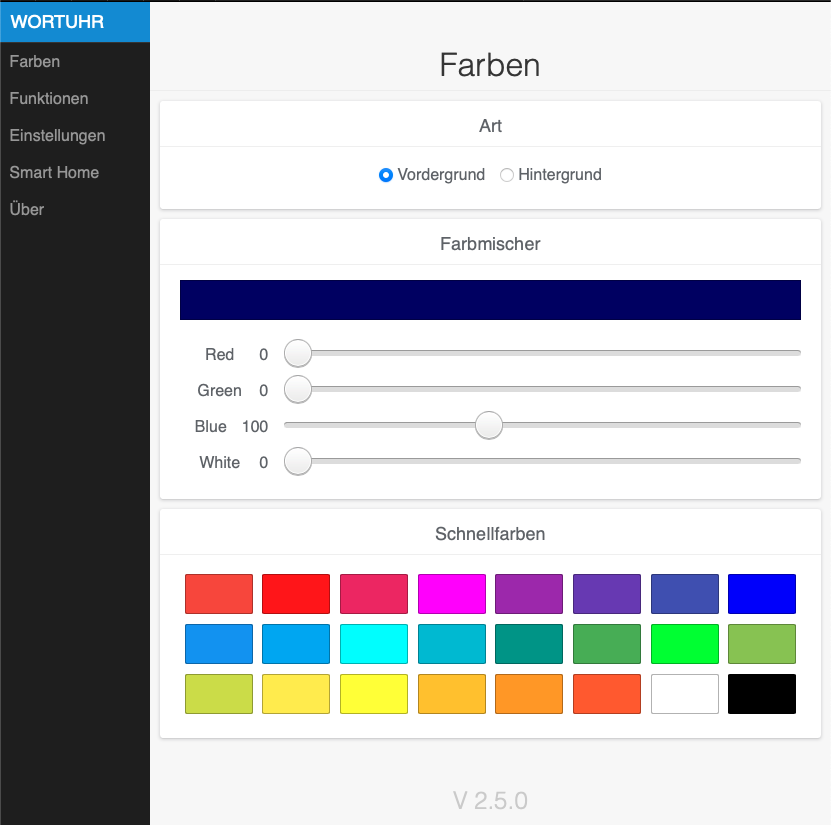
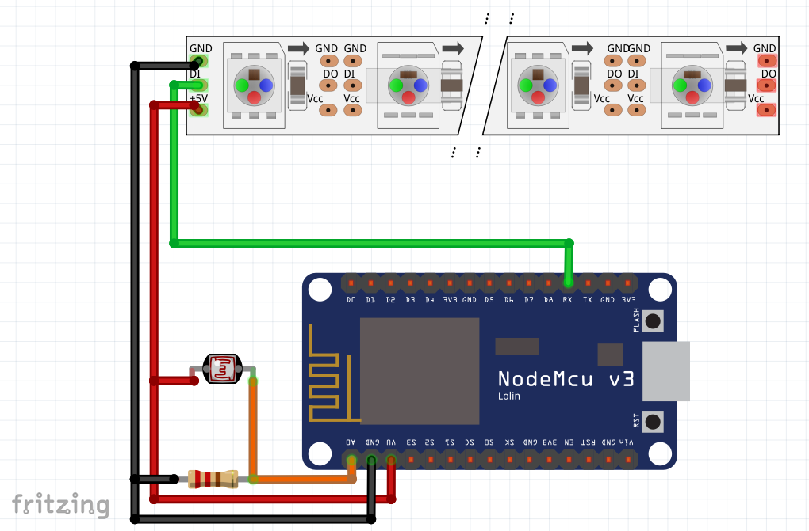

# Wortuhr - Version <!-- VER_placeholder1 -->2.5.0

Hier findet man alle nötigen Informationen zur Worduhr.

### Einleitung 
Es handelt sich hier um die Version <!-- VER_placeholder2 -->2.5.0 der Wortuhr (Wordclock). Aufbauend auf dem Projekt von [Ulrich Radig](https://web.archive.org/web/20180422160812/http://www.ulrichradig.de/home/index.php/projekte/wort-uhr-neu) (Stand 2019, die Website ist mittlerweile offline).

## Für den Nachbau wird folgende Hardware/Software benötigt:
* Hardware
    * NodeMCU (getestetes Board Lolin Version3) oder vergleichbares Board mit einem ESP8266 
    * WS2812B, WS2816 RGB LED Stripes oder SK6812 RGBW Stribes
    * Netzteil 5V 2A
    * 470 Ohm Widerstand
    * Optional: LDR, 10 KOhm Widerstand
* Software
    * Arduio IDE oder Platformio IDE

## Anschluss WS2812 oder SK6812 Stripe
* RX = Data Bus
* GND = Ground
* VV = 5V
* Pegelanpassung 3,3V zu 5V siehe docs

## Anschluss LDR (optional)

      
## Verzeichnisstruktur

-   `pics` enthält Bilder
-   `svg` enthält SVG Dateien
-   `Wortuhr` enthält den Sketch für Arduino und das Webinterface
-   `docs` enthält Anleitungen
-   `bin` enthält die Binary (Für die Uhrenvariante *UHR_114*)

## Arduino IDE vorbereiten
* Datei \> Voreinstellungen \> Zusätzliche Boardverwalter-URLs \> "http://arduino.esp8266.com/stable/package_esp8266com_index.json"
* Werkzeuge \>  Board \> Boardverwalter \> esp8266 Board installieren
    * Weitere Informationen sind auf der [Github Seite des Entwicklers zu finden](https://github.com/esp8266/Arduino)
* Unter Datei \> Sketch \> Include Libraries folgende Bibliotheken hinzufügen:
    * '[NeoPixelBus](https://github.com/Makuna/NeoPixelBus)' von Mankuna
    * '[Time](https://github.com/PaulStoffregen/Time)' von PaulStoffregen
    * '[ArduinoJson](https://github.com/bblanchon/ArduinoJson)' von BBlanchon
    * '[Timezone](https://github.com/JChristensen/Timezone)' von JChristensen
    * '[WebSockets](https://www.arduino.cc/reference/en/libraries/websockets/)' von Arduino
    * '[NTPClient](https://github.com/arduino-libraries/NTPClient)' von arduino-libraries
    * '[RTClib](https://github.com/adafruit/RTClib)' von adafruit
    * '[PubSubClient](https://www.arduino.cc/reference/en/libraries/pubsubclient/)' von Nick O'Leary
    
## To DO & (Ideen):
* Symbol zu einem bestimmten Datum/Uhrzeit
* Getrennte Helligkeitsregelung Hintergrundbeleuchtung/Anzeige 
* "The Matrix" effekt
* Minten Effekte
* Silvester Countdown
* HomeKit Support
* Alexa/GoogleHome Support
* HSI Farb Selektor auf der Website

## Known Bugs

## ChangeLog
### Version 2.5.0
* (dbambus) 2020xxxx  
* Updated Python-Script to update Version String based on VER in Uhr.h
* Improved internal handling of Command/Mode Selection
* Improved memoryusage on RAM
* Added Auto-Shutdown of Wifi-AP-Mode after 5 Minutes, if unused. Just restart Wordclock to enable
* Added a WPS Support with Button on Website 
* Added MQTT Support
* Added up to date responsive design for Website
* Added dedicated Link to Firmware Update Page
* Fixed Issue for compiling with Arduino IDE
* Fixed Handling of Text-input on Website

### Version 2.4.2
* (Eisbaeeer) 20201025   
* fixed var [resource,str, apikey] openweathermap
* new config need, because var of apikey changed in lenght. Please change Serial

### Version 2.4.1   
* (Eisbaeeer) 20201024
* fixed upgrade json 5 to 6 in openweathermap by parsing
* fixed json parsing reagarding too small vars
* fixed missing "break" points in "uhr_func_242.hpp"
* fixed too small vars to website char str[]
* limit var char str[] to need value

### Version 2.4.0
* (dbambus) 20201022   
* Cleaned up .ino Functions for Wifi, EEPROM und Websockets
* Moved them to external Headers
* C++ polymorphismus introduced with Uhrtypes, moved them to external folders
* Fixed Issue `struct for stripes`
* Changed Structure of Webpage-folder on Github
* Added Python Script to compile C-header for webpage
* Now it is possible to Change Type of Wordclock on Webpage and Colortype -> Unified Firmware
* Fixed Issue of showing wrong words on LED Front if entering Settings of Website
* Removed almost all #IfDefs

### Version 2.3.2
* (Eisbaeeer) 20201009   
* fix uhr_242 (Zeile 272 Uhr.h)

### Version 2.3.1
* (Eisbaeeer) 20201008   
* upgrade ArduinoJson 5 zu ArduinoJson 6 (bitte nur noch ArduinoJson >= Version 6 verwenden)

### Version 2.3.0
* (dbambus)
* Aufräumen der Uhr.h für die Übersichtlichkeit
* Restrukturierung der Worduhr.ino um IDE Clang gerecht zu werden
* Weiteres Entfernen von nicht benötigten #IfDefs im Code
* Weitere Enums und Structs für UHR_Typen hinzugefügt
* Umstellung der NTP Funktion der Uhr auf eine externe Library NTPClient
* Support von RTCs zum Beispiel `DS1307`, `DS3231` und `PCF8523`
* Behebung eines Fehlers im SSID Handling. Nun werden SSIDs mit Leerzeichen korrekt eingelesen.
* Hinzufügen eines OfflineModus durch Abschalten der WLAN-Moduls über die Website bis zum Neustart.
### Version 2.2.2
* (dbambus)
* Aufräumen der Uhr_func.h für die Übersichtlichkeit
* Entfernen der nicht relevanten IfDefs in Uhr_func.h für bessere Lesbarkeit
* Habe die Commits von Wandmalffarbes Branche hinzugefügt (Website betreffend)
* Fixes für ein Großteil der Compiler-Warnungen 
* Umstellung auf eine neue HSV-to-RGB Conversion
* Entfernen der Websockets Header Dateien aus dem Repo, hier ein neuer Verweis auf neue Libs in der Readme
* Ordnerstruktur angepasst für cross-kompatiblität Platformio/Arduino
### Version 2.2.1
* (Eisbaeeer)
* Bugfix Openweathermap (freeze without Wifi connection)
* Enhanced DEBUG uhr_242
* Correction global vars Openweathermap json parser
### Version 2.2.0
* (dbambus)
* Bugfixes für Kohttps://www.arduino.cc/reference/en/libraries/websockets/nfigseite #7
* Support für SK6812 RGBW Stribes
* Hinzufügen eines neunen Layouts UHR_114_Fränkisch     
### Version 2.1.1
* (Pascal Wagler)
* Neues Webinterface hinzugefügt
* Arduino-Projekt umbenannt
* Alten `lib`-Ordner und die Datei `7x5 Font.xlsx` gelöscht
* (Atho95)
* Neueste Version der WebSockets - Bugfix Nullpointer in Debug-Ausgabe (payload)
     Im Directory Uhr_Neu befindet sich noch die alte Version (könnte gelöscht werden)
* Buffer für IP Adressen auf 20 erhöht (sprintf hängt '\0' an)
* uhr_func_114.h erweitert auf umgekehrt angeschlossene LED's
* uhr.h erweitert, um auch RGB LED's konfigurieren zu können
### Version 2.1.0
* (Eisbaeeer)
* Bugfix null pointer
* Code weiter aufgeräumt
* Minuten arrays gefixt
* Neue Uhr Version 242 (Open Weather Map)
### Version 2.0.12
* (Elektron79)
* Bugfix Passwort speichern
### Version 2.0.11
* (Eisbaeeer)
* Bugfix issue #3 (Leerstelle in SSID)
### Version 2.0.10
* (masju)
* Erweiterung Randbeleuchtung ("Ambilight") für die 114-LED-Version
### Version 2.0.9
* (Eisbaeeer)
* Telnet Server für Debugging
### Version 2.0.8
* (Flo455)
* WLAN Scan hinzugefügt
### Version 2.0.7
* (Eisbaeeer)
* LDR für Hintergrundhelligkeit
### Version 2.0.6
* (path83 & masju & Eisbaeeer)
* Over The Air Update Link in Webconfig
### Version 2.0.5
* (Eisbaeeer)
* IP Adresse per Laufschrift ausgeben
* LDR Kalibrierung über WebConfig
### Version 2.0.4
* (path83 & Eisbaeeer)
* LDR für automatische Helligkeitsregelung
### Version 2.0.3
* (Eisbaeeer)
* Neue Variante mit 11x11 Reihen LED´s hinzugefügt
### Version 2.0.2
* (Eisbaeeer)
* fix NTP DNS lookup (falsche IP im DNS lookup)
### Version 2.0.1
* (Markus Aust)
* Minuten LED´s
* (Eisbaeeer)
* Versionierung
### Version 2.0.0 
* (Ulrich Radig)
* inital version   

### MIT Lizenz

Jedem, der eine Kopie dieser Software und der zugehörigen Dokumentationsdateien (die "Software") erhält, wird hiermit kostenlos die Erlaubnis erteilt, ohne Einschränkung mit der Software zu handeln, einschließlich und ohne Einschränkung der Rechte zur Nutzung, zum Kopieren, Ändern, Zusammenführen, Veröffentlichen, Verteilen, Unterlizenzieren und/oder Verkaufen von Kopien der Software, und Personen, denen die Software zur Verfügung gestellt wird, dies unter den folgenden Bedingungen zu gestatten:

Der obige Urheberrechtshinweis und dieser Genehmigungshinweis müssen in allen Kopien oder wesentlichen Teilen der Software enthalten sein.

DIE SOFTWARE WIRD OHNE MÄNGELGEWÄHR UND OHNE JEGLICHE AUSDRÜCKLICHE ODER STILLSCHWEIGENDE GEWÄHRLEISTUNG, EINSCHLIEßLICH, ABER NICHT BESCHRÄNKT AUF DIE GEWÄHRLEISTUNG DER MARKTGÄNGIGKEIT, DER EIGNUNG FÜR EINEN BESTIMMTEN ZWECK UND DER NICHTVERLETZUNG VON RECHTEN DRITTER, ZUR VERFÜGUNG GESTELLT. DIE AUTOREN ODER URHEBERRECHTSINHABER SIND IN KEINEM FALL HAFTBAR FÜR ANSPRÜCHE, SCHÄDEN ODER ANDERE VERPFLICHTUNGEN, OB IN EINER VERTRAGS- ODER HAFTUNGSKLAGE, EINER UNERLAUBTEN HANDLUNG ODER ANDERWEITIG, DIE SICH AUS, AUS ODER IN VERBINDUNG MIT DER SOFTWARE ODER DER NUTZUNG ODER ANDEREN GESCHÄFTEN MIT DER SOFTWARE ERGEBEN. 
