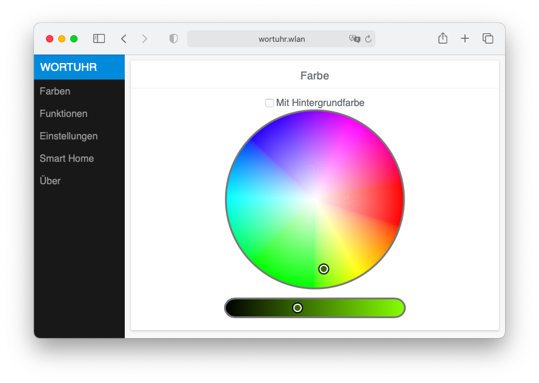
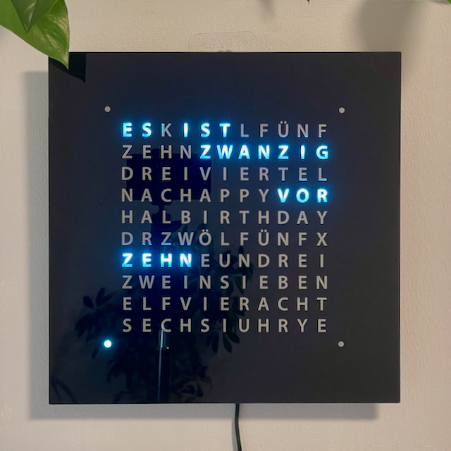
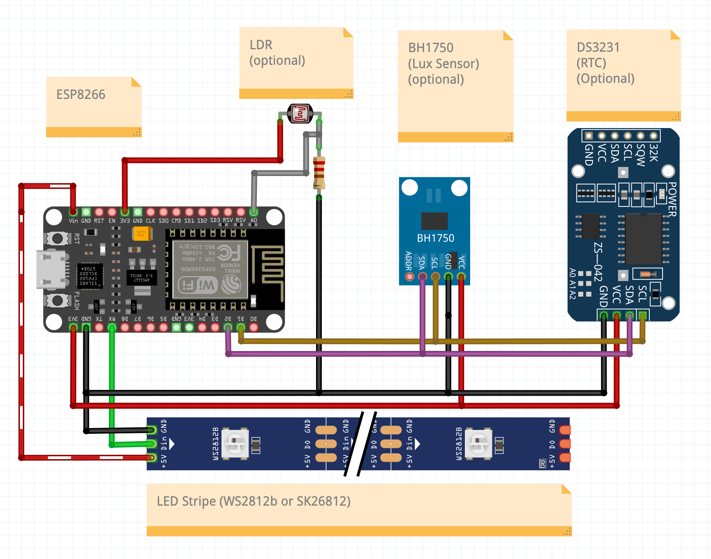

  
# ESP Wordclock

English description further below.



Dies ist ein Projekt für eine mehrsprachige Wortuhr auf Grundlage eines ESP8266-Mikrocontrollers und einer programmierbaren LED-Leiste (WS2812 oder SK6812). Eine Wortuhr ist ein wunderschönes DIY-Projekt für Anfänger, das Technologie und Design kombiniert, um eine funktionale und ästhetisch ansprechende Uhr zu schaffen. 
Egal, ob Sie ein Anfänger oder ein erfahrener Bastler sind, dieses Projekt ist eine großartige Möglichkeit, Ihre Fähigkeiten unter Beweis zu stellen und etwas wirklich Besonderes zu schaffen.
Die Software hat viele Funktionen:
- Mehrsprachig (🇬🇧, 🇩🇪, 🇪🇸, 🇮🇹, 🇳🇱, 🇭🇺, 🇷🇴, 🇨🇭, 🇷🇺, 🇸🇪, 🇫🇷)
- Unterstützung für mehrere Layouts und LED-Abstände
- Farbwechsel der Displayfarbe möglich (RGB oder RGBW)
- Digitale Uhranzeige
- Regenbogenfarbwechsel
- Umgebungslicht (als Sekundenzeiger ausgeführt) 
- Automatische Helligkeitsregelung (optional über LDR) 
- Auswahl an dialektspezifischen Anzeigen
- Home-Assistant-Einbindung mit Autodiscovery


## Betriebsmodi der Uhr

<p align="center">
 
 
 
 
 
</p>

## Die folgende Hardware/Software wird für dieses Projekt benötigt:
* Hardware
    * NodeMCU oder vergleichbares Board mit einem dem ESP8266 oder ESP8285 Chip
    * WS2812B RGB-LED-Streifen oder SK6812 RGBW-Streifen
    * Stromversorgung 5V 2A
    * Optional: LDR, 10 KOhm-Widerstand

* Software
    * PlatformIO [Core](https://docs.platformio.org/en/latest/core/installation.html) oder [IDE](https://platformio.org/install/ide?install=vscode)
    * [Node.js](https://www.nodejs.org/)
    * [Git](https://git-scm.com)

## Installation 
### Windows

* Installieren Sie PlatformIO IDE, Node.js und Git manuell über die oben genannten Links.
* Dadurch wird Visual Studio Code installiert, mit einem PlatformIO-Symbol (Ameisenkopf/Alien) in der Seitenleiste.
* Gehen Sie zu 'Quick Access / Miscellaneous' und geben Sie den Befehl 'Clone Git Project' ein, und geben Sie 'https://github.com/ESPWortuhr/Wortuhr' als URL ein.
* Gehen Sie dann zu 'Projekte', fügen Sie das neue Projekt mit 'Vorhandenes hinzufügen' zur Liste hinzu und klicken Sie auf 'Öffnen'.
* In der PlatformIO-Seitenleiste erscheint nun 'Project Tasks'. Wählen Sie den Befehl 'General / Upload' (dauert ein paar Minuten, die Software wird zuerst erstellt).
* Schließen Sie den ESP-8266 über USB an. Wenn die Wortuhr-Software erstellt ist, wird sie auf dem ESP installiert.

### MacOS

Der einfachste Weg wäre mit [homebrew](https://docs.brew.sh/Installation):

```sh
brew install platformio
brew install node
git clone https://github.com/ESPWortuhr/Wortuhr
cd Wortuhr
pio run -t upload
```

### Linux

```sh
python3 -c "$(curl -fsSL https://raw.githubusercontent.com/platformio/platformio/master/scripts/get-platformio.py)"
sudo apt install npm
git clone https://github.com/ESPWortuhr/Wortuhr
cd Wortuhr
pio run -t upload
```

## Anschließen des WS2812/ SK6812 LED Streifens
* RX = DI / Datenbus
* G = GND / Masse
* VU = 5V

## Anschluss der Hardware

      
## Verzeichnisstruktur

- `pics` enthält Bilder
- `svg` enthält SVG-Dateien
- `include` enthält C-Header-Dateien
- `src` enthält C-Quelldateien
- `webpage` enthält das Webinterface
- `docs` enthält Handbücher
- `templates` enthält Fräs- und Laserdaten

### BSD-3 Lizenz

Diese Software ist unter der BSD-Lizenz lizenziert und darf frei verwendet werden. Es ist erlaubt, sie zu kopieren, zu verändern und zu verbreiten.
Die einzige Bedingung ist, dass der Copyright-Hinweis des Originalprogramms nicht entfernt werden darf.

## ENGLISH Textversion


This is a project for a multilingual word clock based on an ESP8266 microcontroller and a programmable LED strip (WS2812 or SK6812). A word clock is a beautiful DIY project for beginners that combines technology and design to create a functional and aesthetically pleasing clock. 
Whether you're a beginner or an experienced hobbyist, this project is a great way to show off your skills and create something truly special.
The software has many features:
- Multilingual  (🇬🇧, 🇩🇪, 🇪🇸, 🇮🇹, 🇳🇱, 🇭🇺, 🇷🇴, 🇨🇭, 🇷🇺, 🇸🇪, 🇫🇷)
- Support for multiple layouts and LED spacing
- Colour change of the display colour possible (RGB or RGBW)
- Digital clock display
- Rainbow colour change
- Ambient light (designed as a second hand) 
- Automatic brightness control (optional via LDR) 
- Selection of dialect-specific displays
- Home Assistant integration with auto-discovery
  


## The following hardware/software are required for this project:
* Hardware
    * NodeMCU (tested board Lolin Version3 and Wemos D3 mini) or comparable board with an ESP8266 
    * WS2812B, WS2816 RGB LED Stripes or SK6812 RGBW Stribes
    * Power supply 5V 2A
    * Optional: LDR, 10 KOhm resistor
* Software
    * PlatformIO [Core](https://docs.platformio.org/en/latest/core/installation.html) or [IDE](https://platformio.org/install/ide?install=vscode)
    * [Node.js](https://www.nodejs.org/)
    * [Git](https://git-scm.com)

## Installation 
### Windows

* Manually install PlatformIO IDE, Node.js and Git using the links above.
* This will install Visual Studio Code, with a PlatformIO icon (ant head/alien) in the sidebar.
* Go to 'Quick Access / Miscellaneous' and enter the command 'Clone Git Project', and enter 'https://github.com/ESPWortuhr/Wortuhr' as the URL.
* Then go to 'Projects', add the new project to the list by 'Add Existing' and click on 'Open'.
* Then in the PlatformIO sidebar 'Project Tasks' appears. Select the command 'General / Upload' (takes a few minutes, the software will be built first).
* Connect the ESP-8266 via USB. When the word clock software is built, it will be installed on the ESP.

### MacOS

The easiest way would be with [homebrew](https://docs.brew.sh/Installation):

```sh
brew install platformio
brew install node
git clone https://github.com/ESPWortuhr/Wortuhr
cd Wortuhr
pio run -t upload
```

### Linux

```sh
python3 -c "$(curl -fsSL https://raw.githubusercontent.com/platformio/platformio/master/scripts/get-platformio.py)"
sudo apt install npm
git clone https://github.com/ESPWortuhr/Wortuhr
cd Wortuhr
pio run -t upload
```

## Connecting the WS2812/ SK6812 Stripe
* RX = DI / Data Bus
* G = GND / Masse
* VU = 5V

## Connection of the hardware

      
## directory structure

- `pics` contains images
- `svg` contains SVG files
- `include` contains C header files
- `src` contains C source files
- `webpage` contains the web interface
- `docs` contains manuals
- `templates` contains milling and laser data

## To DO & (Ideen):
* HomeKit Support
* Home Assistant Support

### BSD-3 License

This software is licensed under the BSD license and may be used freely. It is allowed to copy, modify and distribute it.
The only condition is that the copyright notice of the original program must not be removed.
