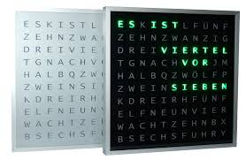

# Ulrich Radig Wort Uhr Version 2

Hier findet man alle nötigen Informationen der Wort Uhr von Ulrichradig.de      

### Einleitung 
Es handelt sich hier um die Version 2 der Wort Uhr. 
Informationen unter http://www.ulrichradig.de/home/index.php/projekte/wort-uhr-neu   

## Für den Nachbau wird folgende Hardware/Software benötigt:
* NodeMCU (getestetes Board Lolin Version3)
* WS2812B oder WS2816 RGB LED Stripes
* Netzteil 5V 2A
* Arduino Version 1.8.1

## Anschluss
* RX = Data Bus
* GND = Ground
* VV = 5V
 
## Verzeichnisstruktur
* pics enthält Bilder
* source enthält den Sketch für Arduino
* libs enthält alle benötigten Libs
* docs enthält Anleitungen   

## Arduino 1.8.5 vorbereiten
* Datei --> Voreinstellungen --> Zusätzliche Boardverwalter-URLs --> "http://arduino.esp8266.com/stable/package_esp8266com_index.json"
* Werkzeuge --> Board --> Boardverwalter --> esp8266 Version 2.3.0 installieren
* lib Verzeichnis in das Arduino library Verzeichnis kopieren

## To DO (Ideen):
* Symbol zu einem bestimmten Datum/Uhrzeit
* Getrennte Helligkeitsregelung Hintergrundbeleuchtung/Anzeige   

## ChangeLog                      

### Version 2.0.0 
* (Ulrich Radig)
* inital version   
### Version 2.0.1
* (Markus Aust)
* Minuten LED´s