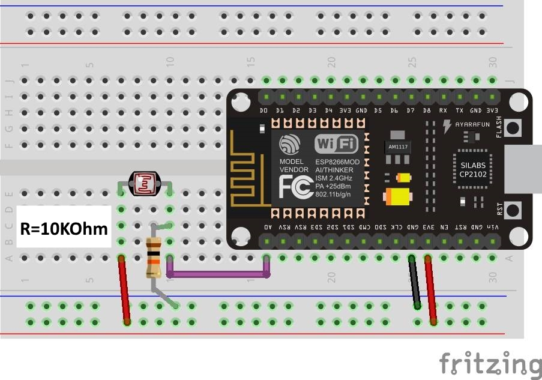

# Ulrich Radig Wort Uhr Version 2

Hier findet man alle nötigen Informationen der Wort Uhr von Ulrichradig.de      

### Einleitung 
Es handelt sich hier um die Version 2 der Wort Uhr. 
Informationen unter http://www.ulrichradig.de/home/index.php/projekte/wort-uhr-neu   

## Für den Nachbau wird folgende Hardware/Software benötigt:
* NodeMCU (getestetes Board Lolin Version3)
* WS2812B oder WS2816 RGB LED Stripes
* Netzteil 5V 2A
* Arduino Version 1.8.5
* 470 Ohm Widerstand
* Optional: LDR, 10 KOhm Widerstand

## Anschluss WS2812 Stripe
* RX = Data Bus
* GND = Ground
* VV = 5V
* Pegelanpassung 3,3V zu 5V siehe docs

## Anschluss LDR (optional)

      
## Verzeichnisstruktur
* pics enthält Bilder
* dxf enthält DXF Dateien
* source enthält den Sketch für Arduino
* libs enthält alle benötigten Libs
* docs enthält Anleitungen  
* bin enthält die Binary (Für die Uhrenvariante "UHR_114")

## Arduino 1.8.5 vorbereiten
* Datei --> Voreinstellungen --> Zusätzliche Boardverwalter-URLs --> "http://arduino.esp8266.com/stable/package_esp8266com_index.json"
* Werkzeuge --> Board --> Boardverwalter --> esp8266 Version 2.3.0 installieren
* lib Verzeichnis in das Arduino library Verzeichnis kopieren bzw. ZIP importieren

## To DO & (Ideen):
* Symbol zu einem bestimmten Datum/Uhrzeit
* Getrennte Helligkeitsregelung Hintergrundbeleuchtung/Anzeige 
* "The Matrix" effekt
* Minten Effekte
* Silvester Countdown

## ChangeLog                      
### Version 1.1.0
* (Eisbaeeer)
* Bugfix null pointer
* Code weiter aufgeräumt
* Minuten arrays gefixt
* Neue Uhr Version 242 (Open Weather Map)
### Version 2.0.12
* (Elektron79)
* Bugfix Passwort speichern
### Version 2.0.1
* (Markus Aust)
* Minuten LED´s
* (Eisbaeeer)
* Versionierung
### Version 2.0.11
* (Eisbaeeer)
* Bugfix issue #3 (Leerstelle in SSID)
### Version 2.0.10
* (masju)
* Erweiterung Randbeleuchtung ("Ambilight") für die 114-LED-Version
### Version 2.0.9
* (Eisbaeeer)
* Telnet Server für Debugging
### Version 2.0.8
* (Flo455)
* WLAN Scan hinzugefügt
### Version 2.0.7
* (Eisbaeeer)
* LDR für Hintergrundhelligkeit
### Version 2.0.6
* (path83 & masju & Eisbaeeer)
* Over The Air Update Link in Webconfig
### Version 2.0.5
* (Eisbaeeer)
* IP Adresse per Laufschrift ausgeben
* LDR Kalibrierung über WebConfig
### Version 2.0.4
* (path83 & Eisbaeeer)
* LDR für automatische Helligkeitsregelung
### Version 2.0.3
* (Eisbaeeer)
* Neue Variante mit 11x11 Reihen LED´s hinzugefügt
### Version 2.0.2
* (Eisbaeeer)
* fix NTP DNS lookup (falsche IP im DNS lookup)
### Version 2.0.0 
* (Ulrich Radig)
* inital version   

