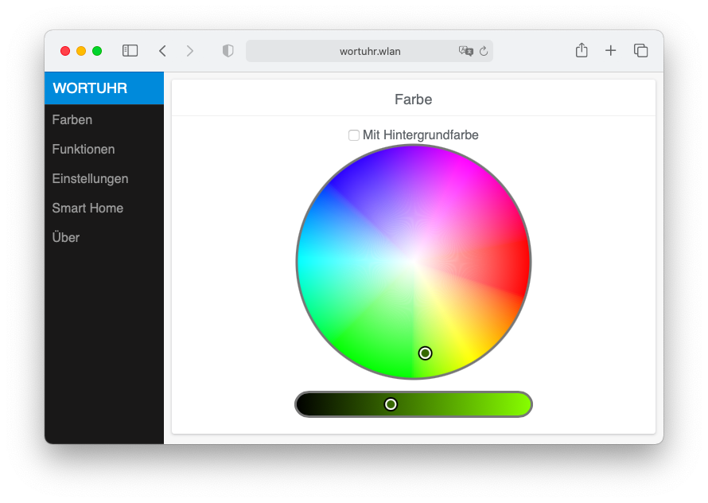
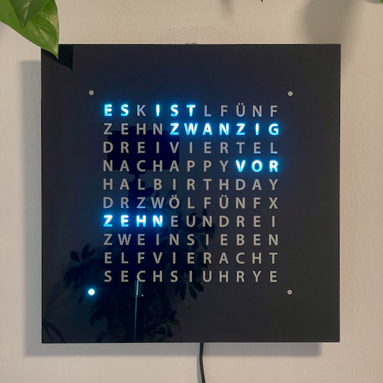
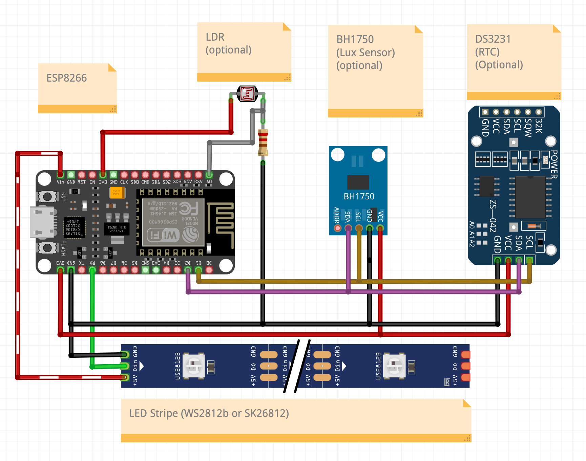

  
# ESP Wordclock



Dies ist ein Projekt für eine mehrsprachige Wortuhr auf Grundlage eines ESP8266-Mikrocontrollers und einer programmierbaren LED-Leiste (WS2812 oder SK6812). Eine Wortuhr ist ein wunderschönes DIY-Projekt für Anfänger, das Technologie und Design kombiniert, um eine funktionale und ästhetisch ansprechende Uhr zu schaffen. 
Egal, ob Sie ein Anfänger oder ein erfahrener Bastler sind, dieses Projekt ist eine großartige Möglichkeit, Ihre Fähigkeiten unter Beweis zu stellen und etwas wirklich Besonderes zu schaffen.
Die Software hat viele Funktionen:
- Mehrsprachig:
  - 🇬🇧 Englisch (English)
  - 🇩🇪 Deutsch
  - 🇪🇸 Spanisch (Español)
  - 🇮🇹 Italienisch (Italiano)
  - 🇳🇱 Niederländisch (Nederlands)
  - 🇭🇺 Ungarisch (Magyar)
  - 🇷🇴 Rumänisch (Română)
  - 🇨🇭 Schweizerdeutsch (Schwiizerdütsch)
  - 🇷🇺 Russisch (Русский)
  - 🇸🇪 Schwedisch (Svenska)
  - 🇫🇷 Französisch (Français)
  - 🇧🇩 Bengalisch (বাংলা)
- Unterstützung für mehrere Layouts und LED-Abstände
- Farbwechsel der Displayfarbe möglich (RGB oder RGBW)
- Digitale Uhranzeige
- Regenbogenfarbwechsel
- Umgebungslicht (als Sekundenzeiger ausgeführt) 
- Automatische Helligkeitsregelung (optional über LDR) 
- Auswahl an dialektspezifischen Anzeigen
- Home-Assistant-Einbindung mit Autodiscovery


## Betriebsmodi der Uhr

<p align="center">
 
 
 
 
 
</p>

## Die folgende Hardware/Software wird für dieses Projekt benötigt:
* Hardware
    * NodeMCU oder vergleichbares Board mit einem dem ESP8266, ESP8285, ESP32 oder ESP32C3
    * WS2812B RGB-LED-Streifen oder SK6812 RGBW-Streifen
    * Stromversorgung 5V 2A
    * Optional: LDR, 10 KOhm-Widerstand

* Software
    * PlatformIO [Core](https://docs.platformio.org/en/latest/core/installation.html) oder [IDE](https://platformio.org/install/ide?install=vscode)
    * [Node.js](https://www.nodejs.org/)
    * [Git](https://git-scm.com)
 
---

## Installation und Flashen der Firmware

Bei vielen Entwickler-Boards (wie dem NodeMCU oder Wemos D1 Mini) benötigen Sie vorab den passenden USB-zu-Seriell-Treiber (meist **CH340** oder **CP210x**). Installieren Sie diesen, falls Ihr Computer das Board nach dem Einstecken nicht erkennt.

### Windows (über grafische Oberfläche)

Der einfachste Weg für Windows-Nutzer führt über die grafische Oberfläche von Visual Studio Code (VS Code).

1. **Voraussetzungen installieren:**
   * Installieren Sie **PlatformIO IDE** (dies installiert automatisch Visual Studio Code), **Node.js** und **Git** manuell über die oben genannten Links.
   * Nach der Installation von VS Code finden Sie ein neues **PlatformIO-Symbol** (einen kleinen Ameisenkopf oder Alien) in der linken Seitenleiste.

2. **Projekt herunterladen (Klonen):**
   * Klicken Sie auf das PlatformIO-Symbol.
   * Gehen Sie im Menü auf `Quick Access` > `Miscellaneous` und wählen Sie `Clone Git Project`.
   * Geben Sie als URL `https://github.com/ESPWortuhr/Wortuhr` ein und wählen Sie einen Speicherort auf Ihrer Festplatte aus.
   * Gehen Sie anschließend auf `Projects`, fügen Sie das soeben heruntergeladene Projekt über `Add Existing` hinzu und klicken Sie auf `Open`.

3. **Software kompilieren und hochladen:**
   * Schließen Sie nun Ihren ESP per USB-Kabel an den Computer an. *(Achtung: Verwenden Sie ein Datenkabel, kein reines Ladekabel!)*
   * In der PlatformIO-Seitenleiste finden Sie den Bereich `Project Tasks`. 
   * Klappen Sie Ihre Board-Umgebung auf und wählen Sie `General` > `Upload`.
   * **Geduld:** Beim ersten Mal dauert dieser Vorgang einige Minuten, da PlatformIO zunächst alle benötigten Bibliotheken im Hintergrund herunterlädt und die Software komplett neu kompiliert. 
   * Nach Abschluss erscheint eine grüne "SUCCESS"-Meldung.

### MacOS

Unter macOS können Sie ebenfalls den Weg über Visual Studio Code gehen (wie bei Windows beschrieben). Für Nutzer, die das Terminal bevorzugen, ist der Weg über den Paketmanager [Homebrew](https://docs.brew.sh/Installation) jedoch deutlich schneller:

1. Öffnen Sie das Terminal.
2. Führen Sie nacheinander die folgenden Befehle aus, um die Tools zu installieren, das Projekt herunterzuladen und auf den ESP zu flashen:

```sh
# PlatformIO und Node.js installieren
brew install platformio
brew install node

# Projektverzeichnis herunterladen
git clone [https://github.com/ESPWortuhr/Wortuhr](https://github.com/ESPWortuhr/Wortuhr)
cd Wortuhr

# ESP anschließen und flashen
pio run -t upload
```

### Linux

Auch unter Linux (z. B. Ubuntu, Debian, Raspberry Pi OS) lässt sich die Firmware bequem über das Terminal kompilieren und flashen.

Wichtiger Hinweis für Linux-Nutzer: Stellen Sie sicher, dass Ihr Benutzerkonto die Berechtigung hat, auf serielle Schnittstellen zuzugreifen (meist durch Hinzufügen des Benutzers zur Gruppe dialout via sudo usermod -a -G dialout $USER). Möglicherweise ist danach ein Neustart erforderlich.

```
# PlatformIO Installationsskript ausführen
python3 -c "$(curl -fsSL [https://raw.githubusercontent.com/platformio/platformio/master/scripts/get-platformio.py](https://raw.githubusercontent.com/platformio/platformio/master/scripts/get-platformio.py))"

# Node.js Paketmanager installieren
sudo apt update
sudo apt install npm git

# Projekt herunterladen und ins Verzeichnis wechseln
git clone [https://github.com/ESPWortuhr/Wortuhr](https://github.com/ESPWortuhr/Wortuhr)
cd Wortuhr

# ESP anschließen und flashen
pio run -t upload
```

### Nach der Installation: Der Erste Start

Sobald der Upload auf den ESP8266 erfolgreich war (Meldung `SUCCESS` im Terminal), startet die Uhr neu.

1. Die Wortuhr spannt nun ein eigenes WLAN-Netzwerk (Access Point) auf.
2. Suchen Sie mit Ihrem Smartphone oder Laptop nach einem neuen WLAN (meist "Wortuhr" oder ähnlich) und verbinden Sie sich damit.
3. Es sollte sich automatisch ein Anmeldefenster öffnen (Captive Portal). Falls nicht, öffnen Sie Ihren Browser und rufen Sie die Adresse `http://192.168.4.1` auf.
4. Tragen Sie dort Ihre heimischen WLAN-Zugangsdaten ein. Die Uhr startet neu, verbindet sich mit Ihrem Heimnetzwerk und ist fortan über ihre eigene IP-Adresse im Netzwerk erreichbar.

---

## Anschluss der Hardware


## Schematischer Aufbau einer Wordclock

Dieser Leitfaden beschreibt den typischen Schichtaufbau und die elektronische Konfiguration einer DIY-Wortuhr. Die Spezifikationen richten sich nach dem klassischen 11x10 Buchstaben-Raster plus 4 separaten Minuten-LEDs.

## 1. Die mechanischen Schichten (Von vorne nach hinten)

* **Frontplatte:** Die sichtbare Schicht mit den ausgestanzten oder ausgelaserten Buchstaben (oft aus Edelstahl, beschichtetem Acryl oder Holzfurnier).
* **Diffusor-Schicht:** Eine milchige Folie oder ein Bogen Architektenpapier direkt hinter der Frontplatte. Sie streut das Licht der LEDs weich und gleichmäßig aus.
* **Lichtgitter (Baffle):** Ein Rasterkreuz (meist aus Holz, MDF oder 3D-Druck), das jede LED räumlich von den anderen trennt. Es verhindert streng das seitliche Überstrahlen des Lichts auf benachbarte, nicht aktive Buchstaben.
* **Trägerplatte (Rückwand):** Eine stabile Platte, auf der die LED-Streifen passgenau zum Lichtgitter waagerecht aufgeklebt werden.

## 2. Spezifikationen der LED-Matrix (WS2812B / Neopixel)

Um das Raster der Buchstaben matrixgetreu auszufüllen, müssen die Abstände der LEDs (LEDs pro Meter) exakt zur Größe der Uhr passen. Basierend auf den gängigen Gehäusegrößen ergeben sich folgende Anforderungen:

| Gehäusegröße (Front) | Matrix-Größe | Empfohlener LED-Stripe | Besonderheit bei der Verkabelung |
| :--- | :--- | :--- | :--- |
| **30 x 30 cm** | 25 x 25 cm | 60 LEDs/m | Standardmaß. Perfekter Abstand der LEDs für jedes Rasterfeld. |
| **40 x 40 cm** | 35 x 35 cm | 74 LEDs/m | Jede zweite LED einer Reihe bleibt ungenutzt (Software- oder Hardwareseitig übersprungen). |
| **50 x 50 cm** | 50 x 50 cm | 30 LEDs/m | Der natürliche Abstand der LEDs passt direkt zum größeren Raster. |

> **Hinweis zur Verklebung:** Die LED-Streifen werden typischerweise schlangenförmig (Zick-Zack-Verkabelung) auf die Trägerplatte geklebt. Der Daten-Ausgang (DOUT) einer Zeile wird dabei mit dem Daten-Eingang (DIN) der direkt darunterliegenden Zeile auf der gleichen Seite verbunden.

## 3. Elektronik und Komponenten


* **Mikrocontroller:** Ein ESP8266 (z.B. Wemos D1 Mini) oder ESP32. Dieser steuert die LEDs und synchronisiert die Uhrzeit meist automatisch über das heimische WLAN (NTP-Server).
* **Stromversorgung:** Ein starkes 5V-Netzteil. Wenn viele Buchstaben in der Farbe Weiß leuchten, kann die Matrix mehrere Ampere Strom ziehen. Ein 5V / 3A bis 5A Netzteil wird empfohlen.
* **Echtzeituhr (RTC):** Ein Modul wie das DS3231 (optional, aber empfohlen). Es sorgt durch eine Knopfzelle dafür, dass die Uhrzeit bei Stromausfall oder fehlendem WLAN exakt weiterläuft.
* **Level-Shifter:** Da der ESP mit 3.3V arbeitet, die LEDs aber 5V Datenpegel erwarten, sichert ein Level-Shifter (z.B. 74AHCT125) eine saubere Signalübertragung (oft reicht aber auch ein direkter Anschluss über einen 470 Ohm Widerstand).

## 4. Basis-Schaltplan

* **Netzteil 5V (+):** Verbinden mit dem 5V-Pin des Mikrocontrollers UND dem 5V-Eingang des LED-Streifens.
* **Netzteil GND (-):** Verbinden mit dem GND-Pin des Mikrocontrollers UND dem GND-Eingang des LED-Streifens.
* **Mikrocontroller Data-Pin:** Verbinden mit dem DIN (Data In) des allerersten LED-Streifens in der Matrix.

---

## Konfigurationsübersicht (vergleiche `includes/Config.h`)

Viele dieser Einstellungen können später auch bequem über das Webinterface der Uhr angepasst werden.

## Hardware & Pins (ESP32)
Legt fest, an welchen Pins die Hardware angeschlossen ist (Hinweis: Der ESP8266 wird für diese spezifischen Pins hier aktuell nicht unterstützt).
* **`LED_PIN`**: Pin für den LED-Datenkanal. *(Standard: 3, bei dem ESP8266 ist das der RX Pin)*
* **`SDA_PIN_ESP32` / `SCL_PIN_ESP32`**: Pins für die I2C-Kommunikation (z.B. für RTC oder Lichtsensor). *(Standard: SDA 21, SCL 22)*
* **`RTC_Type`**: Verwendetes Echtzeituhr-Modul (RTC), damit die Uhr auch ohne WLAN weiterläuft. *(Standard: `RTC_DS3231`)*

## Sprache & Front-Layout
Definiert, in welcher Sprache und mit welchem Raster die Wortuhr aufgebaut ist. Es ist eine Vielzahl an Sprachen hinterlegt (Deutsch, Englisch, Niederländisch, Spanisch, etc.).
* **`DEFAULT_LAYOUT`**: *(Aktiver Standard: `Ger10x11Alternative`)* * 10 Zeilen, 11 LEDs pro Zeile + 4 Minuten-LEDs.
  * Dies ist das alternative deutsche Layout von Github-User @dbambus mit zusätzlichen Wörtern.

## LED & Darstellung
Spezifiziert den Typ der verwendeten LEDs und die Standard-Farbwerte beim Start.
* **`DEFAULT_LEDTYPE`**: Die Farbreihenfolge des LED-Streifens.
* **`WHITE_LEDTYPE`**: Farbtemperatur, falls RGBW-LEDs genutzt werden. *(Standard: `NeutralWhite`)*
* **`DEFAULT_HUE`**: Standard-Farbton beim Start (0-360). *(Standard: `120` - entspricht Grün)*
* **`DEFAULT_BRIGHTNESS`**: Starthelligkeit in Prozent.
* **`DEFAULT_BUILDTYPE`**: Bauart der Matrix. *(Standard: `Normal` - jede LED auf dem Streifen wird genutzt)*
* **`MINUTE_...`**: Art der Minutenanzeige. *(Standard: `MINUTE_LED4x` - 4 separate LEDs für die Minuten)*

## Helligkeitsregelung
Einstellungen für die automatische Helligkeitsanpassung über externe Sensoren.
* **`AUTOBRIGHT_USE_BH1750`**: Nutzung eines digitalen Lichtsensors.
* **`AUTOBRIGHT_USE_LDR`**: Nutzung eines analogen Fotowiderstands.
  * *Hinweis: Da beide auf `false` stehen, ist die automatische Helligkeitsregelung aktuell deaktiviert.*
* **LDR-Widerstandswerte**: Falls ein LDR genutzt wird, sind hier die Kalibrierungswerte für den Spannungsteiler hinterlegt (`RESBRIGHT 15`, `RESDARK 1000`, `RESDIVIDER 10`).

## WLAN & Captive Portal
Konfiguration der Netzwerkanbindung.
* **`MANUAL_WIFI_SETTINGS`**: Legt fest, ob die WLAN-Daten fest im Code hinterlegt sind.
* **`WIFI_SSID`**: Name deines WLANs.
* **`WIFI_PASSWORD`**: Dein WLAN-Passwort.
* **`CP_PROTECTED` / `CP_SSID` / `CP_PASSWORD`**: Einstellungen für das Captive Portal (das eigene WLAN-Netzwerk der Uhr für die Ersteinrichtung). *(Standard: Unverschlüsselt, SSID: `"Connect_to_Wordclock"`)*

## System & Boot-Verhalten
Einstellungen für den Startvorgang und das Debugging.

## Matrix- & Verdrahtungseinstellungen
Hier wird definiert, wie die LEDs physisch in der Uhr verklebt und verdrahtet wurden (z.B. wo der Streifen beginnt und ob er im Zick-Zack verlegt wurde).
* **`REVERSE_MINUTE_DIR`**: Dreht die Laufrichtung der Minuten-LEDs um.
* **`MIRROR_FRONT_VERTICAL` / `HORIZONTAL`**: Spiegelt die Anzeige vertikal oder horizontal.
* **`EXTRA_LED_PER_ROW`**: Falls zusätzliche (blinde) LEDs pro Zeile verbaut sind.
* **`FLIP_HORIZONTAL_VERTICAL`**: Tauscht X- und Y-Achse (nützlich bei falscher Ausrichtung).
* **`MEANDER_ROWS`**: Gibt an, ob der LED-Streifen schlangenförmig (Zick-Zack) verklebt wurde.
---

## MQTT API Dokumentation

Die Uhr verwendet das **JSON Light Schema** von Home Assistant. Das bedeutet, dass Befehle und Statusmeldungen im JSON-Format über MQTT ausgetauscht werden.

## 1. MQTT Topics (Themen)
Die Uhr verwendet ein Basis-Topic, welches in den Einstellungen der Uhr (Webinterface) definiert wird. In dieser Dokumentation wird es als `<TOPIC>` bezeichnet (z.B. `ESPWordclock`).

| Funktion | Topic | Beschreibung |
| :--- | :--- | :--- |
| **Befehle senden** | `<TOPIC>/cmd` | An dieses Topic sendest du JSON-Befehle, um die Uhr zu steuern. |
| **Status empfangen** | `<TOPIC>/status` | Auf diesem Topic veröffentlicht die Uhr nach jeder Änderung ihren aktuellen Status. |
| **Verfügbarkeit** | `<TOPIC>/availability` | Zeigt an, ob die Uhr online ist (`online` oder `offline` via Last Will). |

---

## 2. Befehle Senden (Command Payload)
Befehle werden als JSON-String an das Topic `<TOPIC>/cmd` gesendet. Du kannst mehrere Parameter in einer einzigen Nachricht kombinieren.

### Unterstützte JSON-Parameter:

* **`state`** (String)
  Schaltet die LEDs der Uhr ein oder aus.
  * Werte: `"ON"` oder `"OFF"` *(Muss zwingend großgeschrieben werden!)*
* **`brightness`** (Integer)
  Steuert die Helligkeit der LEDs.
  * Werte: `0` bis `255`
* **`color`** (Object)
  Setzt die Vordergrundfarbe der Uhr im HSB-Farbraum (Hue, Saturation).
  * `h` (Hue/Farbton): `0` bis `360` (Grad)
  * `s` (Saturation/Sättigung): `0` bis `100` (%)
* **`effect`** (String)
  Wechselt den Anzeigemodus / das Programm der Uhr.
  * Werte: 
    * `"Wordclock"` (Normale Wortuhr)
    * `"Seconds"` (Sekundenanzeige)
    * `"Digitalclock"` (Digitale Uhrzeit)
    * `"Scrollingtext"` (Lauftext)
    * `"Rainbowcycle"` (Regenbogen-Zyklus)
    * `"Rainbow"` (Regenbogen statisch)
    * `"Color"` (Einfarbig)
    * `"Symbol"` (Symbolanzeige, z.B. Herz)
* **`scrolling_text`** (String)
  Legt den Text fest, der im Effekt `"Scrollingtext"` angezeigt wird.
  * Werte: Beliebiger Text (max. Länge abhängig von den C++ Speichereinstellungen).

---

## 3. Beispiele für MQTT-Befehle

**Uhr einschalten, auf 100% Helligkeit setzen und Farbe auf Rot ändern:**
```json
{
  "state": "ON",
  "brightness": 255,
  "color": {
    "h": 0,
    "s": 100
  }
}
```

**Modus auf "Lauftext" ändern und Text vorgeben:**
```json
{
  "effect": "Scrollingtext",
  "scrolling_text": "Hallo Welt!"
}
```

**Uhr ausschalten:**
```json
{
  "state": "OFF"
}
```

---

## 4. Status Empfangen (Status Payload)

Sobald die Uhr einen Befehl verarbeitet hat (oder sich intern etwas ändert), sendet sie ihren Zustand an <TOPIC>/status. Dies ist besonders wichtig, damit Smart Home Systeme (wie Home Assistant) den aktuellen Zustand kennen.

**Beispielhafter Status-Rückgabewert:**

```json
{
  "state": "ON",
  "color": {
    "h": 120,
    "s": 100
  },
  "brightness": 128,
  "color_mode": "hs",
  "effect": "Wordclock"
}
```

(Hinweis: color_mode: "hs" wird von Home Assistant benötigt, um zu wissen, dass die Farbe im Hue/Saturation-Format vorliegt).

---

## 5. Home Assistant Auto-Discovery
Diese Uhr unterstützt MQTT Auto-Discovery für Home Assistant.
Wenn die Uhr startet oder der Button "MQTT Discovery" im Webinterface gedrückt wird, sendet sie automatisch ihre komplette Konfiguration an das Topic:

`homeassistant/light/<TOPIC>/light/config`

Dadurch taucht die Wortuhr in Home Assistant vollautomatisch als Licht-Entität auf. Du hast dort sofort Zugriff auf:

- Ein/Aus Schalter
- Helligkeits-Schieberegler
- Farbwähler (Farbrad)
- Ein Dropdown-Menü für alle Effekte (Wordclock, Rainbow, etc.)

### BSD-3 Lizenz

Diese Software ist unter der BSD-Lizenz lizenziert und darf frei verwendet werden. Es ist erlaubt, sie zu kopieren, zu verändern und zu verbreiten.
Die einzige Bedingung ist, dass der Copyright-Hinweis des Originalprogramms nicht entfernt werden darf.
